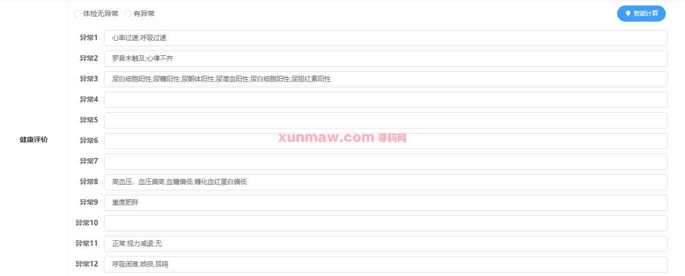

# 体检录入系统

#### 介绍
  本体检信息录入系统采用前端：vue；后端：springboot+mybatis-plus+redis+mysql技术架构开发，前后端分离，容易上手。除了基本的体检结果查询、录入及导出外，在录入中还能对录入信息进行智能计算。  

#### 软件架构
后端：springboot | mybatis-plus | redis | mysql  
前端：vue  
系统环境：jdk1.8 | mysql | redis | nodejs14+  

#### 功能结构

#### 功能介绍
##### 【代码结构与数据库截图】

##### 【功能详述】 
 △登录  
    使用账号登录系统  

 △体检结果查询  
    页面显示体检结果列表，可以通过录入时间段、录入医生、患者来查询体检结果。录入医生与患者查询规则为模糊匹配。列表显示患者名称、患者性别、体检日期、录入医生、自定义体检编号及备注信息。可以对结果进行“编辑”和“删除”。  

 △录入体检结果  
    在新建体检与对已有体检结果编辑时，会使用到录入体检结果功能。  
    可以通过点击左侧目录快速定位到目标区域。  
    录入体检结果包含的内容有基础信息、体检类型、检查途径、症状、一般状况、生活方式、脏器功能、宣体、辅助检查、现存主要健康问题、住院治疗情况等在体检中需要填写的内容。  

    在健康评价部分，点击“智能计算”，系统可以根据已经填写的体检数据智能判断，生成健康评价。  

 △批量导出  
    在体检结果查询的列表页，点击“导出”可以导出当前筛选结果。将导出结果以excel文件形式下载至本地。  

#### 使用说明
后端：
    1. 创建数据库，执行数据库脚本  
    2. 修改jdbc数据库连接参数  
    3. 下载安装maven依赖jar  
    4. 启动springboot启动类  
前端：  
    1. npm install  
    2. npm run build  
请求地址： http://localhost:8080    admin|123456      
